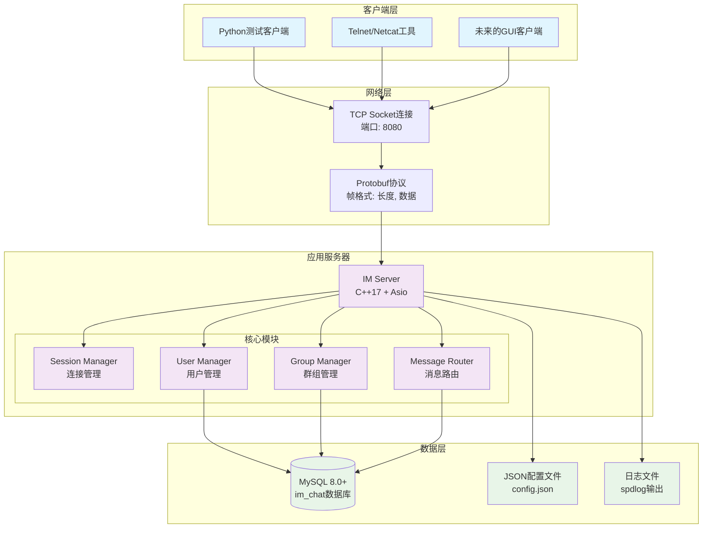
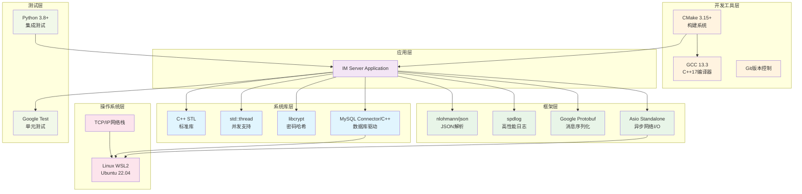
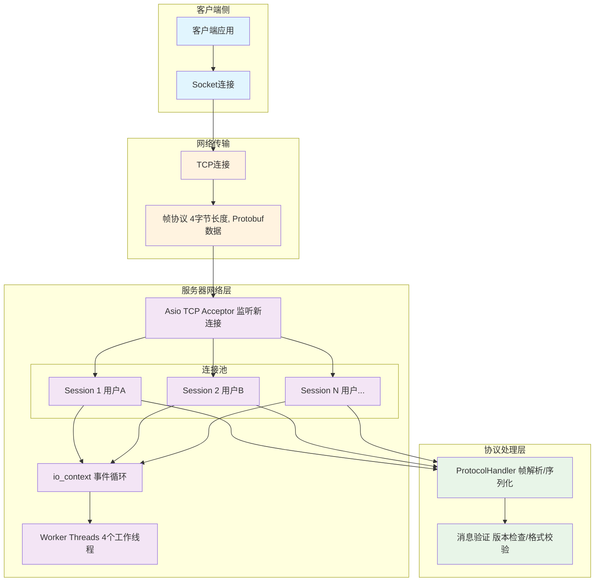
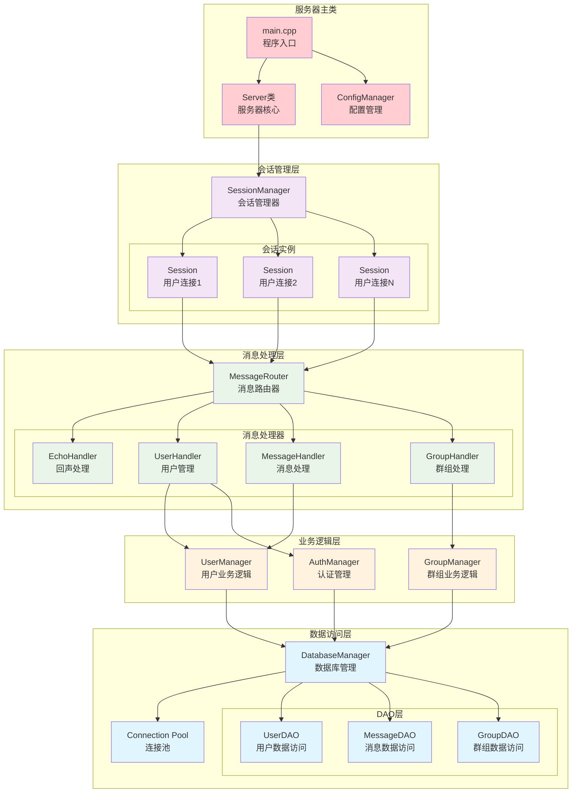
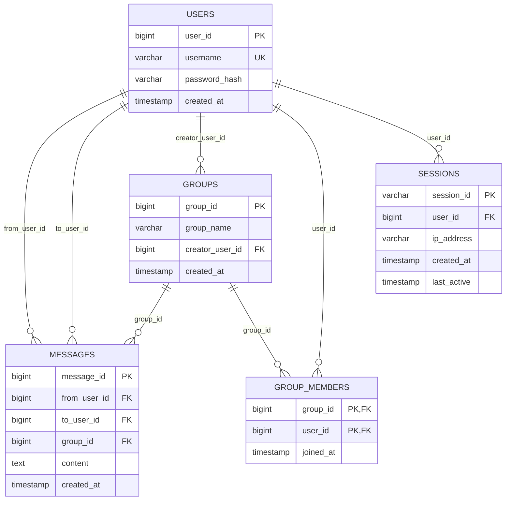
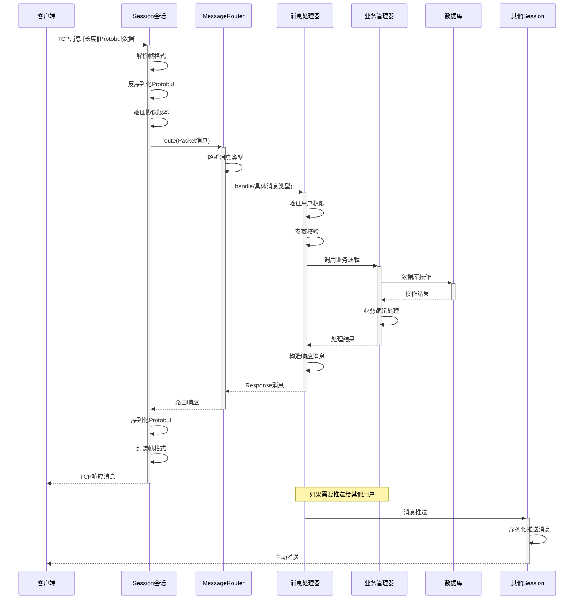
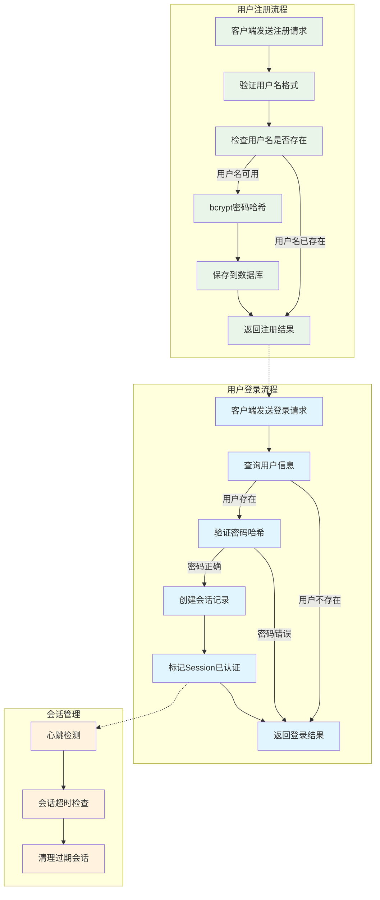
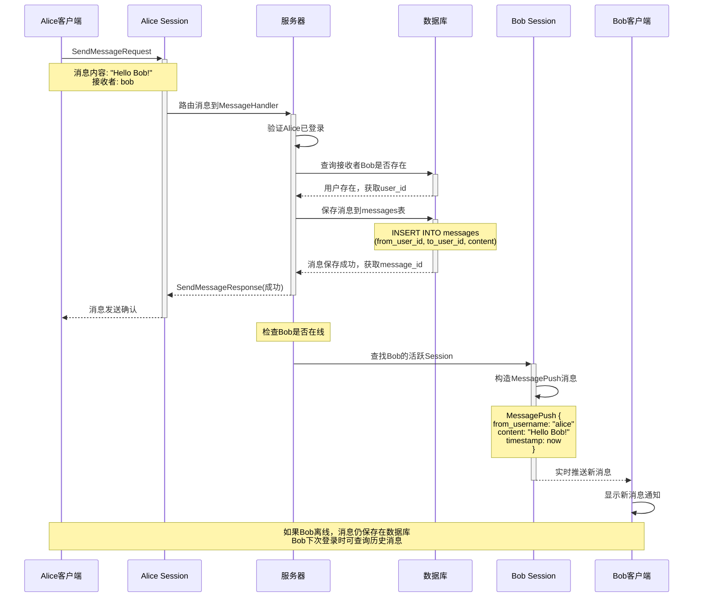
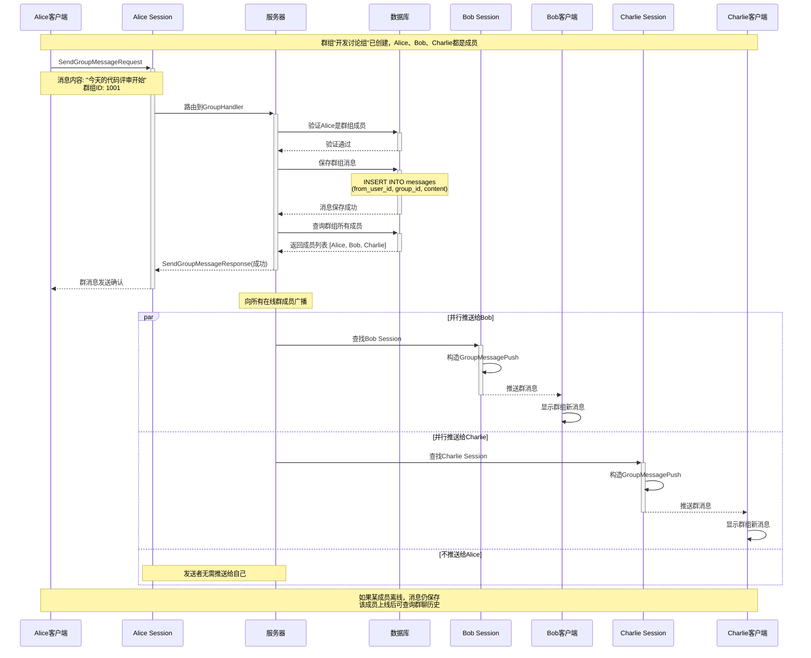

# MyTelegram 项目架构框架图

本文档使用 Mermaid 图表全面展示 MyTelegram 即时通讯系统的架构设计，涵盖系统架构、技术栈、网络通信、数据库设计以及各种业务流程。

## 目录
- [MyTelegram 项目架构框架图](#mytelegram-项目架构框架图)
  - [目录](#目录)
  - [1. 总体系统架构](#1-总体系统架构)
  - [2. 技术栈架构](#2-技术栈架构)
  - [3. 网络通信架构](#3-网络通信架构)
  - [4. 服务器内部架构](#4-服务器内部架构)
  - [5. 协议层架构](#5-协议层架构)
  - [6. 数据库架构](#6-数据库架构)
    - [表结构说明:](#表结构说明)
    - [索引策略:](#索引策略)
  - [7. 消息路由流程](#7-消息路由流程)
  - [8. 用户认证流程](#8-用户认证流程)
  - [9. 私聊消息流程](#9-私聊消息流程)
  - [10. 群聊消息流程](#10-群聊消息流程)
  - [总结](#总结)
    - [🏗️ 架构亮点:](#️-架构亮点)
    - [🚀 技术特色:](#-技术特色)

---

## 1. 总体系统架构

展示整个系统的高级组件架构，包括客户端、服务器和数据存储层。

**架构说明:**
- **客户端层**: 支持多种客户端类型，通过TCP连接到服务器
- **网络层**: 使用TCP协议和自定义的Protobuf帧格式进行通信
- **应用服务器**: C++实现的高性能异步服务器，采用模块化设计
- **数据层**: MySQL数据库持久化存储，配置文件和日志支持

---

## 2. 技术栈架构

展示项目使用的完整技术栈和各层次的依赖关系。

**技术栈说明:**
- **现代C++**: 使用C++17特性，提供高性能和内存安全
- **异步I/O**: Asio库实现高并发网络处理
- **结构化通信**: Protobuf确保类型安全的消息传输
- **企业级数据库**: MySQL提供可靠的数据持久化
- **全面测试**: 单元测试+集成测试保证代码质量

---

## 3. 网络通信架构

展示TCP连接管理、会话处理和协议解析的网络层设计。

**网络架构特点:**
- **异步I/O模型**: 使用Asio库实现高并发连接处理
- **会话管理**: 每个客户端连接对应一个Session对象
- **事件驱动**: io_context配合线程池处理网络事件
- **协议安全**: 帧长度限制(1MB)防止内存攻击

---

## 4. 服务器内部架构

展示服务器核心类的关系和消息处理的内部流程。

**架构设计原则:**
- **分层架构**: 清晰的职责分离，从网络层到数据层
- **依赖注入**: 上层依赖接口，下层实现具体功能
- **单一职责**: 每个类专注于特定的功能领域
- **可扩展性**: 新的消息类型只需添加对应的Handler

---

## 5. 协议层架构

展示Protobuf消息格式、帧结构和协议处理的详细设计。

```mermaid
graph TB
    subgraph "协议格式"
        FRAME_FORMAT[帧格式\n4字节长度\nProtobuf数据]
        MAX_SIZE[最大帧长度 1MB\n防止内存攻击]
        BYTE_ORDER[网络字节序\n大端格式]
    end
    
    subgraph "Protobuf消息结构"
        PACKET[Packet 根消息]
        VERSION[version uint32\n协议版本=1]
        SEQUENCE[sequence uint32\n请求-响应匹配]
        
        subgraph "系统消息 (1-99)"
            ECHO_REQ[EchoRequest = 10\nEchoResponse = 11]
            HEARTBEAT[HeartbeatRequest = 20\nHeartbeatResponse = 21]
        end
        
        subgraph "用户管理 (100-199)"
            REGISTER[RegisterRequest = 100\nRegisterResponse = 101]
            LOGIN[LoginRequest = 102\nLoginResponse = 103]
        end
        
        subgraph "消息相关 (200-299)"
            SEND_MSG[SendMessageRequest = 200\nSendMessageResponse = 201]
            MSG_PUSH[MessagePush = 202]
        end
        
        subgraph "群组功能 (300-399)"
            CREATE_GROUP[CreateGroupRequest = 300\nCreateGroupResponse = 301]
            JOIN_GROUP[JoinGroupRequest = 302\nJoinGroupResponse = 303]
            SEND_GROUP_MSG[SendGroupMessageRequest = 304]
        end
        
        ERROR_RESP[ErrorResponse = 999\n统一错误处理]
    end
    
    subgraph "错误处理体系"
        ERROR_CODES[错误码分类]
        PROTO_ERR[1000-1099\n协议错误\n版本不匹配/格式错误]
        AUTH_ERR[2000-2099\n认证错误\n登录失败/会话过期]
        BIZ_ERR[3000-3099\n业务错误\n用户不存在/权限不足]
        SYS_ERR[4000-4099\n系统错误\n数据库错误/内部异常]
    end
    
    FRAME_FORMAT --> PACKET
    MAX_SIZE --> PACKET
    BYTE_ORDER --> PACKET
    
    PACKET --> VERSION
    PACKET --> SEQUENCE
    PACKET --> ECHO_REQ
    PACKET --> HEARTBEAT
    PACKET --> REGISTER
    PACKET --> LOGIN
    PACKET --> SEND_MSG
    PACKET --> MSG_PUSH
    PACKET --> CREATE_GROUP
    PACKET --> JOIN_GROUP
    PACKET --> SEND_GROUP_MSG
    PACKET --> ERROR_RESP
    
    ERROR_RESP --> ERROR_CODES
    ERROR_CODES --> PROTO_ERR
    ERROR_CODES --> AUTH_ERR
    ERROR_CODES --> BIZ_ERR
    ERROR_CODES --> SYS_ERR
    
    classDef frame fill:#f3e5f5
    classDef message fill:#e8f5e8
    classDef system fill:#fff3e0
    classDef user fill:#e1f5fe
    classDef chat fill:#f1f8e9
    classDef group fill:#fce4ec
    classDef error fill:#ffebee
    
    class FRAME_FORMAT,MAX_SIZE,BYTE_ORDER frame
    class PACKET,VERSION,SEQUENCE message
    class ECHO_REQ,HEARTBEAT system
    class REGISTER,LOGIN user
    class SEND_MSG,MSG_PUSH chat
    class CREATE_GROUP,JOIN_GROUP,SEND_GROUP_MSG group
    class ERROR_RESP,ERROR_CODES,PROTO_ERR,AUTH_ERR,BIZ_ERR,SYS_ERR error

```

**协议设计特点:**
- **版本兼容**: 协议版本字段支持向后兼容演进
- **类型安全**: Protobuf强类型系统确保消息安全
- **可扩展性**: 预留字段编号便于功能扩展
- **标准化错误**: 统一的错误码体系和处理机制

---

## 6. 数据库架构

展示MySQL数据库的表结构设计和关系模型。

**数据库设计特点:**

### 表结构说明:

1. **USERS 用户表**
   - `user_id`: 主键，自增ID
   - `username`: 唯一用户名，建立索引
   - `password_hash`: bcrypt哈希密码
   - `created_at`: 注册时间

2. **MESSAGES 消息表**
   - `message_id`: 主键，自增ID
   - `from_user_id/to_user_id`: 私聊消息的发送方和接收方
   - `group_id`: 群聊消息的群组ID（可为空）
   - `content`: 消息内容
   - `created_at`: 消息时间
   - 索引: `(from_user_id, to_user_id, created_at)` 支持会话历史查询

3. **GROUPS 群组表**
   - `group_id`: 主键，自增ID
   - `group_name`: 群组名称
   - `creator_user_id`: 群组创建者
   - `created_at`: 创建时间

4. **GROUP_MEMBERS 群成员表**
   - 复合主键: `(group_id, user_id)`
   - `joined_at`: 加入时间
   - 支持多对多关系：用户-群组

5. **SESSIONS 会话表**
   - `session_id`: 会话唯一标识
   - `user_id`: 关联用户
   - `ip_address`: 客户端IP
   - `last_active`: 最后活跃时间

### 索引策略:
- `users.username`: 唯一索引，登录查询
- `messages.conversation`: 复合索引，聊天历史查询
- `group_members`: 复合主键，群成员关系查询
- `sessions.user_id`: 普通索引，用户会话查询

---

## 7. 消息路由流程

展示从接收客户端消息到业务处理完成的完整流程。

**流程关键点:**
1. **帧解析**: 验证长度字段，防止缓冲区溢出
2. **协议验证**: 检查版本兼容性和消息格式
3. **权限检查**: 验证用户登录状态和操作权限  
4. **事务处理**: 数据库操作的原子性保证
5. **异步推送**: 支持向其他在线用户主动推送消息

---

## 8. 用户认证流程

展示用户注册和登录的完整业务流程。

**安全特性:**
- **密码安全**: 使用bcrypt算法，加盐哈希存储
- **会话管理**: 基于时间的会话超时机制
- **重复登录**: 支持同一用户多设备登录
- **心跳检测**: 定期检测连接状态，自动清理僵尸会话

---

## 9. 私聊消息流程

展示一对一消息发送、存储和实时推送的完整流程。

**私聊特性:**
- **消息持久化**: 所有消息存储到数据库，支持历史查询
- **实时推送**: 在线用户立即收到新消息通知
- **离线支持**: 用户离线时消息保存，上线后可查询
- **消息确认**: 发送方收到消息投递确认

---

## 10. 群聊消息流程

展示群组消息的广播分发和成员管理流程。

**群聊特性:**
- **成员验证**: 只有群组成员才能发送群消息
- **广播机制**: 消息自动推送给所有在线群成员  
- **发送者排除**: 避免向消息发送者推送自己的消息
- **并行处理**: 使用异步I/O同时向多个成员推送
- **历史保存**: 群组消息持久化，支持历史记录查询

---

## 总结

MyTelegram项目采用现代C++和成熟的开源技术栈，实现了高性能、可扩展的即时通讯系统。整体架构特点：

### 🏗️ 架构亮点:
- **分层设计**: 网络层→协议层→业务层→数据层，职责清晰
- **异步I/O**: 基于Asio的高并发网络处理
- **消息路由**: 灵活的消息类型分发和处理机制
- **协议安全**: Protobuf类型安全+帧长度限制
- **数据一致性**: MySQL事务支持和规范化设计

### 🚀 技术特色:
- **现代C++17**: 智能指针、异步编程、标准库特性
- **企业级组件**: MySQL数据库、spdlog日志、bcrypt安全
- **完整测试**: 单元测试+集成测试+性能测试
- **易于扩展**: 插件式Handler架构，新功能快速集成
- **生产就绪**: 配置管理、错误处理、监控日志完备

这个架构设计既保证了系统的高性能和稳定性，又为后续功能扩展提供了良好的基础。